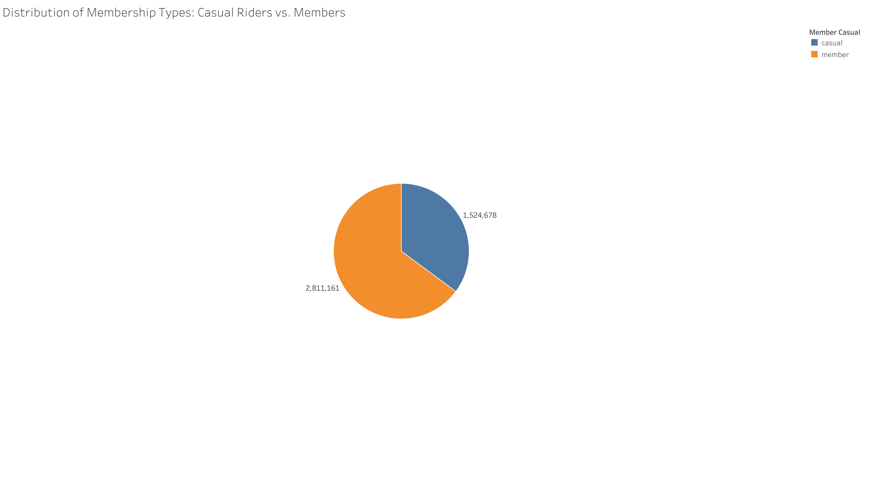
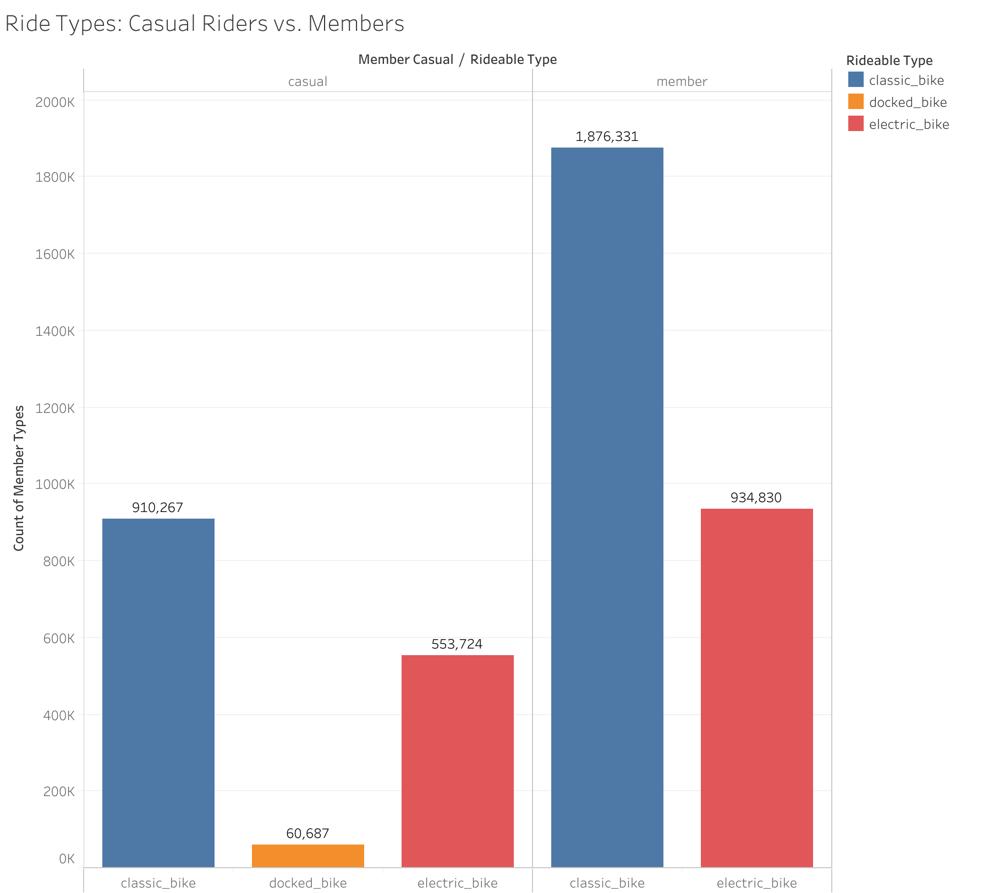
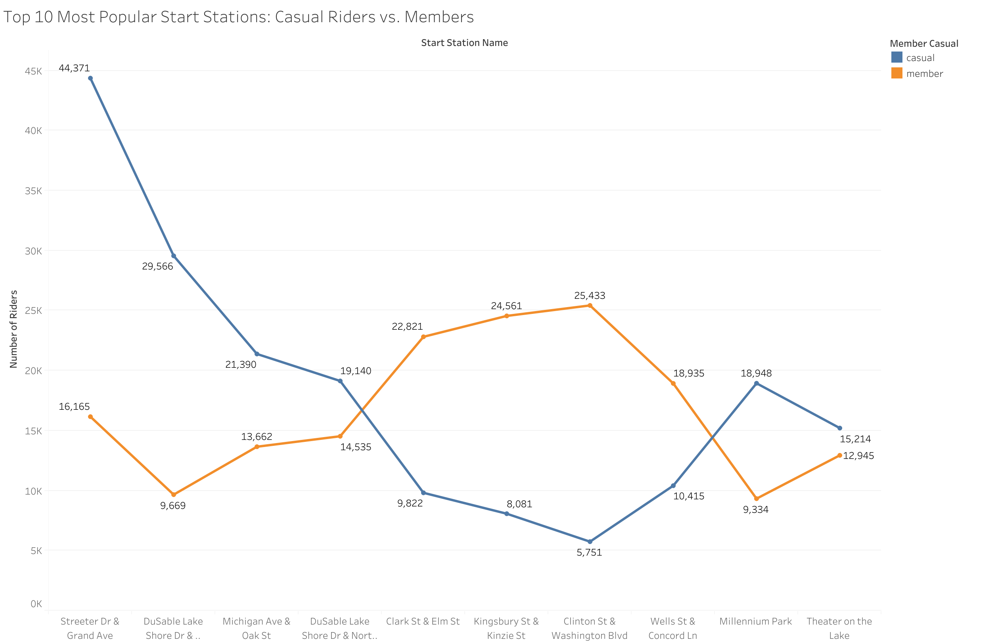
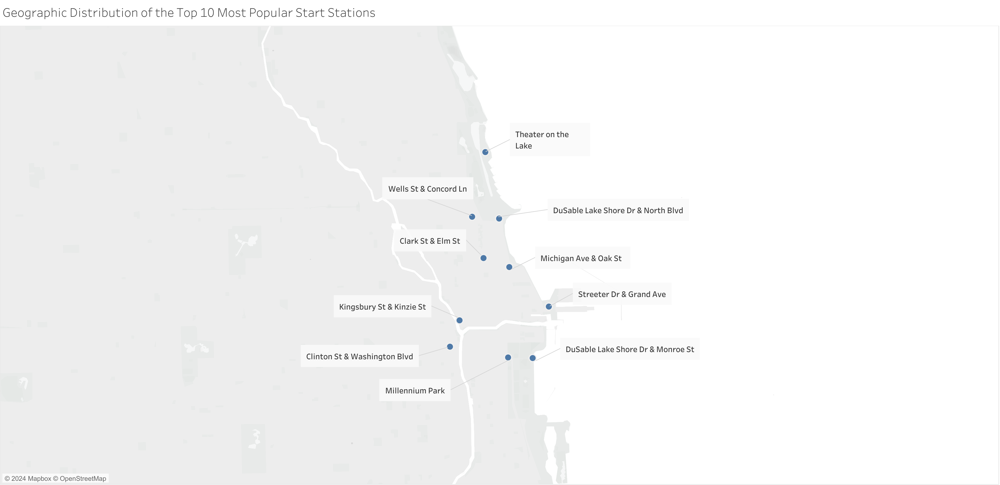
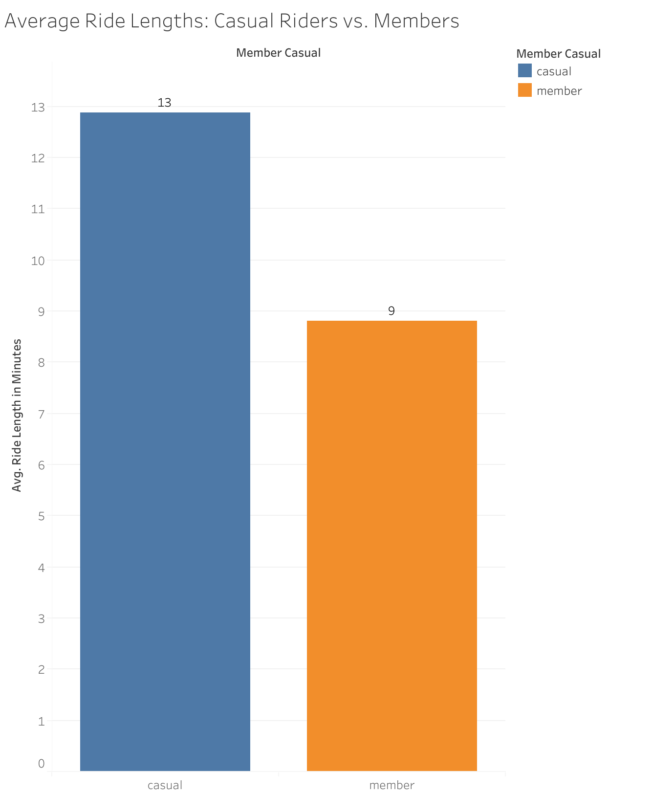
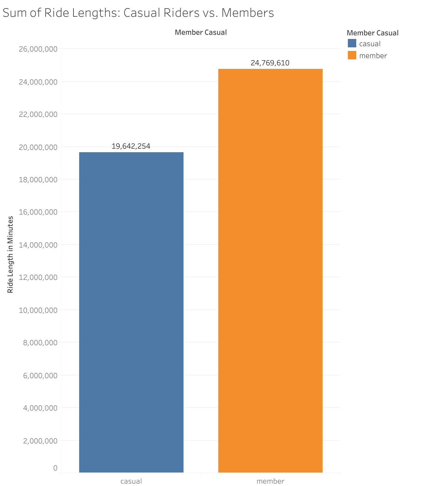
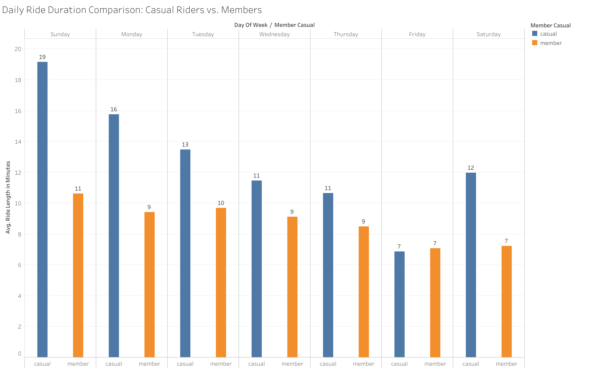
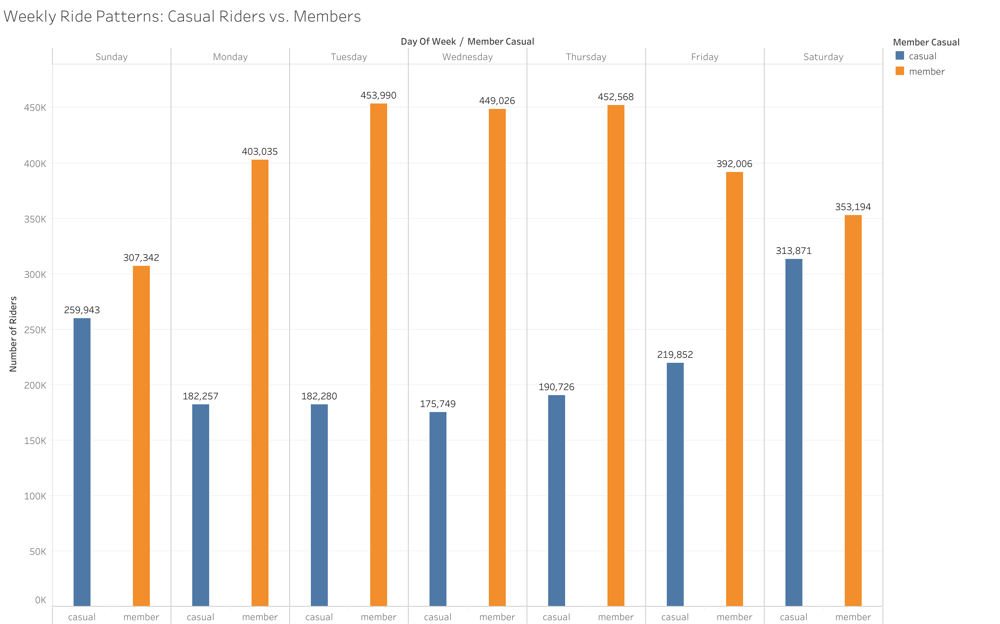
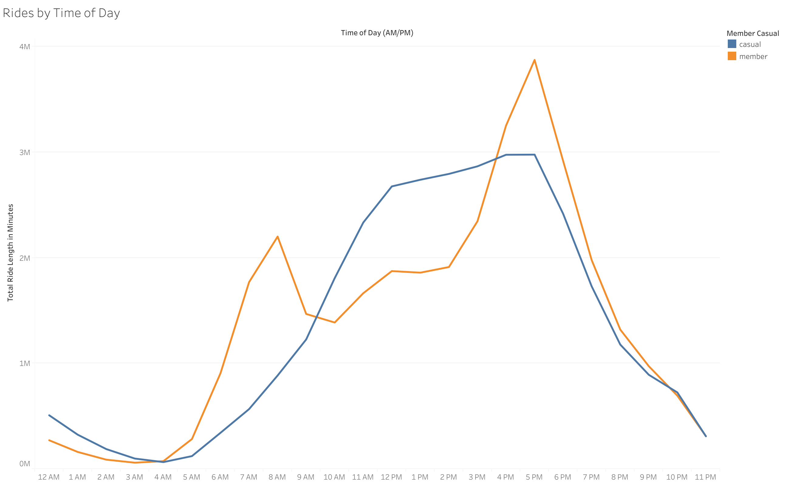

# Analysis and Key Findings with Visualizations

This section presents a detailed analysis of how casual riders and annual members use Cyclistic's bike-share services, supported by visualizations created from the company's trip data. By examining key metrics 
such as ride duration, ride frequency, popular stations, and usage patterns, we aim to uncover significant differences between casual riders and annual members. These insights will inform recommendations for 
marketing strategies aimed at converting casual riders into annual members. 

Each visualization below highlights critical trends and patterns in user behavior, providing a clear understanding of how different rider types interact with Cyclistic’s services. The following analysis ties the 
visual evidence directly to key findings, offering a data-driven approach to the marketing team’s decision-making process.

## 1. Distribution of Membership Types

This pie chart illustrates the **distribution of membership types** for Cyclistic bike riders, separating them into two categories: casual riders and annual members. The total number of riders in each category is displayed directly on the chart. 

The chart shows that **annual members** (*2,811,161*) make up a significantly larger portion of total riders compared to **casual riders** (*1,524,678*). This indicates that more riders have opted for an annual membership, likely enjoying the benefits associated with long-term commitment, such as reduced rates or incentives for frequent use. 

Understanding this distribution is crucial for targeting marketing efforts, as it suggests a large portion of users are already committed to long-term use. The casual rider segment, however, remains a considerable market for conversion into annual memberships. This segmentation provides an opportunity for focused strategies aimed at turning these casual users into members.

## 2. Ride Types

This bar chart compares the types of bikes used by **casual riders** and **members**. The x-axis is divided into two categories: casual and member, and within each category, the rideable types are broken down into **classic bikes (blue)**, **docked bikes (orange; only a label for casual members)**, and **electric bikes (red)**. The y-axis represents the count of member types for each group. 

This chart shows that while both casual riders and members prefer classic bikes, members use them significantly more. For example, members recorded *1,876,331* classic bike rides, compared to *910,267* by casual riders. When it comes to electric bikes, members again take the lead, using them for *934,830* rides, while casual riders logged *553,724* rides. This difference aligns with the overall ratio of **casual riders** (*1,524,678*) to **members** (*2,811,161*), suggesting that electric bikes are a secondary preference for both groups. Docked bikes, however, are least preferred by both members and casual riders, with very low usage (*60,687* for **casual riders** and none for members). 

The dominance of classic bike usage by both casual riders and members suggests both groups may prioritize **traditional biking**, possibly for routine commuting. The proportion of electric bike usage might reflect preferences for **convenience** or **shorter recreational trips**. Targeting marketing efforts to encourage both types of riders to use classic bikes or promoting the benefits of membership discounts for electric bikes could be effective.

## 3. Top 10 Most Popular Start Stations and their Geographic Distribution

This line graph compares the top 10 most popular starting stations between **casual riders (blue)** and **members (orange)** for Cyclistic bikes. The x-axis lists the start station names, while the y-axis indicates the number of rides that originated from each station. The two lines represent casual riders (blue) and members (orange), showing the number of riders for each member type at these stations. 

The graph highlights several key differences in station preferences between casual riders and members: 

- **Streeter Dr & Grand Ave** is the most popular start station for casual riders, with *44,371* riders, far exceeding any station used by members. 

- In contrast, **Kingsbury St & Kinzie St** and **Clinton St & Washington Blvd** are the most popular among members, with *24,561* and *25,433* riders, respectively. 

The difference between the number of riders at each station is lowest at **DuSable Lake Shore Dr & North Blvd**, where both casual and member riders show only an approximate *4,500*-rider difference, indicating shared popularity for this station.

The **geographic distribution** of these stations provides further insights into the preferences of casual riders and members. Casual riders' strong preference for stations near waterfront locations and tourist-heavy areas suggests that they are more likely to begin rides in scenic or popular tourist spots, such as:

- **Streeter Dr & Grand Ave** (seemingly located near a pier),
- **Millennium Park**, and
- **DuSable Lake Shore Dr & North Blvd**.

These stations may be located in areas that attract tourists or casual users who may ride for leisure or sightseeing purposes.

In contrast, members demonstrate more distributed usage patterns across the city. Stations like Kingsbury St & Kinzie St and Clinton St & Washington Blvd, located further from tourist attractions, indicate a preference for practical, everyday travel, such as commuting to work or running errands.

This geographic distribution aligns with the hypothesis that casual riders primarily use the service for recreational purposes, while members likely use it for functional, more frequent trips. Understanding these geographical differences is essential for designing targeted promotions, as marketing efforts could focus on encouraging casual riders to explore the benefits of membership, even when starting from scenic or leisure-focused stations.

## 4. Average Ride Lengths 

This bar chart compares the average ride duration between **casual riders (blue)** and **members (orange)** in minutes. The chart displays two bars, with casual riders represented in blue and members in orange. **Casual riders** average around *13* minutes per ride, while **members** have shorter average rides, around *9* minutes.

This visualization reveals that casual riders tend to use Cyclistic bikes for longer trips compared to annual members. The difference in ride length could indicate that casual riders are more likely to use the service for leisure, leading to longer, more infrequent rides. On the other hand, members likely use the bikes for shorter, perhaps more frequent, trips such as commuting. This insight aligns with the hypothesis that casual riders could be incentivized to switch to membership if offered promotions targeting their leisure-based usage patterns, encouraging more frequent, shorter rides at a lower cost through a membership plan.

## 5. Sum of Ride Lengths

This bar chart compares the total ride lengths in minutes between **casual riders (blue)** and **members (orange)**. The y-axis represents the total ride length in minutes, while the x-axis differentiates between casual and member riders.

**From the data:**
- **Members use bikes more extensively:** Members have logged significantly more total ride time compared to casual riders—approximately *24.8 million* minutes versus around *19.6 million* minutes. This suggests that members tend to use the bikes more frequently or take longer trips overall.
- **Casual riders still have substantial usage:** While members account for more ride time, casual riders contribute a significant portion as well, with about *79%* of the members’ total. This indicates that casual riders are an important segment for Cyclistic.
- **Frequency of use:** Annual members seem to use the service more frequently or for longer rides, leading to a higher cumulative ride length. This makes sense as members pay for a subscription and likely have easier, unlimited access to the bikes.
- **Casual rider patterns:** Casual riders, though contributing a significant amount of total ride time, may use the service for more leisurely or one-off occasions rather than regular commutes or frequent short trips, which is typical of members. The difference in total ride lengths suggests that casual riders engage less with the service on a regular basis compared to members.

This data suggests that marketing efforts could aim to convert casual riders to members by emphasizing the benefits of membership, potentially increasing both total usage and revenue for Cyclistic.

## 6. Daily Ride Durations

This bar chart compares the **average ride length (in minutes)** of **casual riders (blue)** and **members (orange)** across each day of the week. The x-axis represents the days of the week, with each day split into two bars: one for casual riders and one for members. The y-axis indicates the average ride length in minutes.

The visualization reveals that casual riders consistently have longer ride durations compared to annual members across all days of the week. Notably:

- **Sunday** shows the highest difference, where casual riders' average ride length is *19* minutes, while members average *11* minutes.
- Casual riders also show a significant difference on **Monday**, averaging *16* minutes compared to members' *9* minutes.
- The ride lengths are most similar on **Friday**, with both casual riders and members averaging around *7* minutes.
- The average ride length for members drops on Friday into Saturday and rises again on Sunday, indicating that members may use bikes for shorter, more routine trips at the start of the weekend, possibly for quick errands. By Sunday, the increase in ride length could suggest more leisurely rides as members take advantage of their free time. This pattern aligns with the idea that members' bike usage on Saturdays is focused on brief outings, while Sundays see a shift towards longer, recreational rides as the weekend winds down.
- The average ride length for casual members consistently drops during weekdays and rises during weekends, suggesting casual riders tend to use the service more for lesiure or extended trips on weekends.

These insights into daily ride durations provides a valuable opportunity to create targeted marketing strategies:

- **Weekend Leisure Promotions:** Casual riders tend to use Cyclistic bikes for longer rides on weekends. Offering weekend promotions such as discounted day passes or special weekend membership rates could encourage casual riders to make the switch to annual memberships.
- **Weekday Commuter Incentives:** Members show shorter ride durations during the weekdays, likely using the service for commuting or quick errands. Introducing weekday commuting packages or ride discounts could further incentivize casual riders to purchase a membership, highlighting the benefits of frequent short trips during the week.
- **Sunday Leisure Focus:** As both casual riders and members show longer ride durations on Sundays, targeted campaigns promoting leisure rides and family-oriented activities could boost engagement on that day. Emphasizing the benefits of memberships for recreational purposes, such as discounts for longer rides, could encourage casual users to consider long-term commitment.

## 7. Weekly Ride Patterns

This bar chart visualizes the Weekly Ride Patterns of Cyclistic bike riders, comparing the ride counts of **casual riders (blue)** and **members (orange)** over the course of a week. Each day of the week is represented on the x-axis, while the y-axis shows the number of riders.

**Key Observations:**

- **Sunday:** Casual riders continue to show elevated bike usage on Sundays compared to weekdays, making Sunday their second busiest day of the week with *259,943* rides. While there are still more members riding on Sunday than casual riders, Sunday marks the lowest ridership for members throughout the week. This suggests that members tend to ride more during the weekdays and slightly less over the weekend, possibly indicating a focus on commuting during the workweek, while casual riders favor weekend leisure activities.
- **Monday to Thursday:** Members exhibit a significant peak in activity between Monday and Thursday, with the highest number of rides recorded on Tuesday (*453,990* rides), Wednesday (*449,026* rides), and Thursday (*452,568* rides). In contrast, casual riders have a relatively lower and more consistent ride pattern during the workweek, ranging between *175,749* and *190,726* rides.
- **Friday:** Casual riders’ ride counts start to increase on Friday, with *219,852* rides, which is higher than their weekday rides. Members continue to show strong activity on Fridays as well, logging *392,006* rides.
- **Saturday:** TThe ride count for casual riders peaks on Saturday with *313,871* rides, while members also show a high activity level with *353,194* rides. However, for members, this marks the beginning of a decline in ridership that continues into Sunday. This shift in their weekly routine as the weekend progresses suggests members may ride less frequently over the weekend compared to weekdays because they likely use the service more for commuting, with less need for transportation during leisure days.

**From these observations:**
-	**Members’ Dominance During Weekdays:** The data clearly shows that members are more active during the weekdays, likely using the bikes for commuting or routine trips. Their highest activity occurs from Tuesday to Thursday, peaking on Tuesday with *453,990* rides.
- **Casual Riders’ Preference for Weekends:** Casual riders show a clear preference for weekend rides, with their highest activity on Saturdays and Sundays. This suggests that casual riders may use the service more for leisure or recreational purposes, as their ride counts rise significantly over the weekend compared to weekdays.

**Marketing Implications:**
-	**Targeting Casual Riders on Weekends:** Since casual riders are more active on weekends, promotions or discounts targeting weekend activities could increase engagement. Special weekend membership offers might attract casual riders who frequently use the service during this period.
-	**Members’ Weekday Usage:** Marketing efforts for members could focus on the benefits of using the bikes for commuting and routine travel, further emphasizing the convenience of bike-share for everyday trips.

## 8. Rides by Time of Day

This line chart shows the total ride length in minutes for **casual riders (blue)** and **members (orange)** throughout the day, from ***12* AM to *11* PM**. The x-axis represents the time of day, and the y-axis represents the total ride length in millions of minutes. The two lines represent casual riders (blue) and members (orange).

**Casual Riders (blue line):**

- Activity gradually rises from early morning (around 5 AM), reaching a peak between ***4* and *5* PM**.
 There is another smaller peak around **noon**.
- Casual riders show significantly lower activity during the early hours of the day and late at night.

**Members (orange line):**

- Members show a clear peak in activity during the **morning commute hours (around *8* AM)** and **evening commute hours (around *5* PM)**.
- There is a notable dip during **midday**, suggesting members are at work and not using their bikes during this time.

**Casual riders** seem to be more leisure-oriented, with their usage peaking during the afternoon and early evening. They ride later in the day, possibly for recreation or after-work activities.

**Members** follow a more predictable commuting pattern, with high activity during traditional work commute times—morning and evening rush hours. This suggests members primarily use the service for daily commuting.

Marketing strategies could target casual riders with promotions during off-peak hours or encourage them to use the service for commuting by offering discounts for morning rides.
